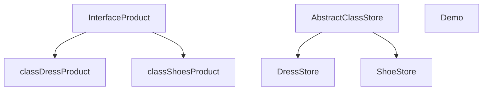
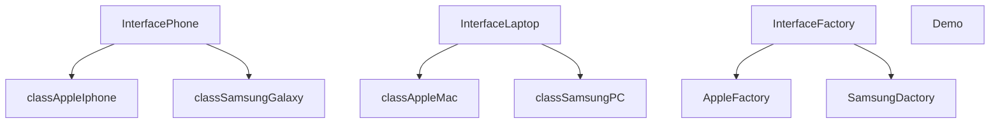
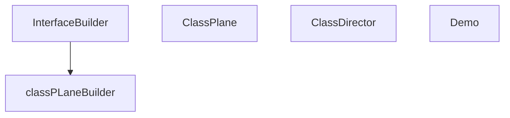
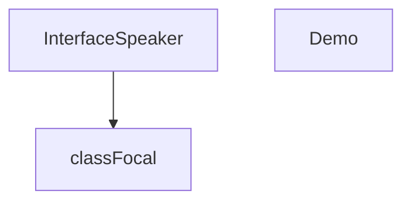
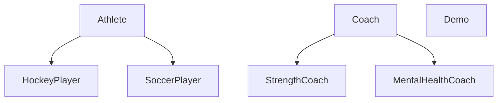

# Design Patterns
## Creational
### Factory Method

```mermaid
graph TD;
    InterfaceProduct-->classDressProduct;
    InterfaceProduct-->classShoesProduct;
    AbstractClassStore-->DressStore;
    AbstractClassStore-->ShoeStore;
    Demo
```
### Abstract Factory

```mermaid
graph TD;
    InterfacePhone-->classAppleIphone;
    InterfacePhone-->classSamsungGalaxy;
    InterfaceLaptop-->classAppleMac;
    InterfaceLaptop-->classSamsungPC;
    InterfaceFactory-->AppleFactory;
    InterfaceFactory-->SamsungDactory;
    Demo
```

### Builder

```mermaid
graph TD;
    InterfaceBuilder-->classPLaneBuilder;
    ClassPlane;
    ClassDirector;
    Demo
```

### Prototype

```mermaid
graph TD;
    InterfaceSpeaker-->classFocal;
    Demo
```
### Singleton

```mermaid
graph TD;
    Singleton;
    Demo
```

## Structural 
### Adapter

```mermaid
graph TD;
    XMLtoJSONconverter
    Demo
```

### Bridge

```mermaid
graph TD;
    Athlete-->HockeyPlayer;
    Athlete-->SoccerPlayer;
    Coach-->StrengthCoach;
    Coach-->MentalHealthCoach;
    Demo;
```

