# Design Patterns
## Creational
### Factory Method

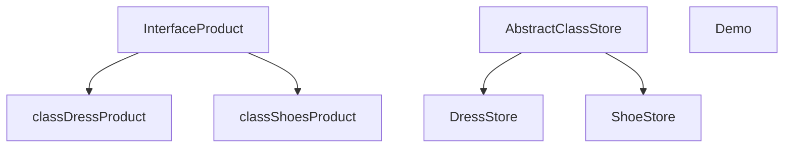
### Abstract Factory

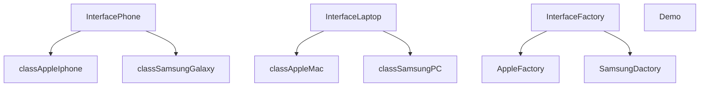

### Builder

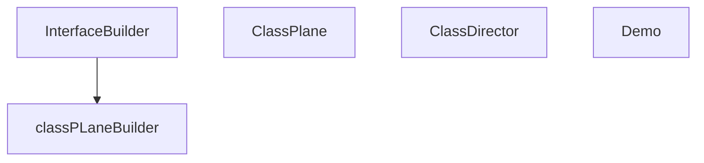

### Prototype
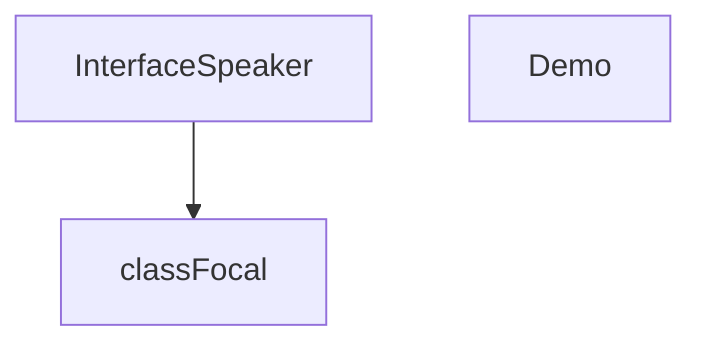
### Singleton
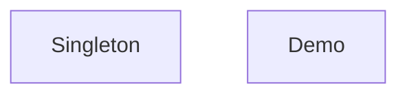

## Structural 
### Adapter
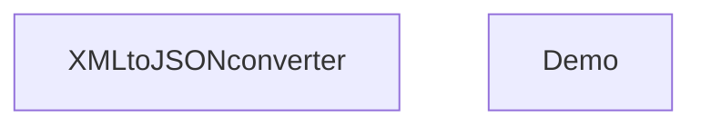

### Bridge
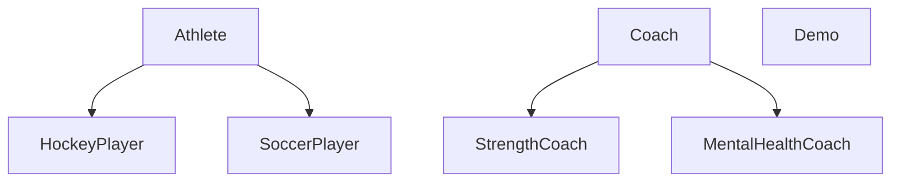

### Composite
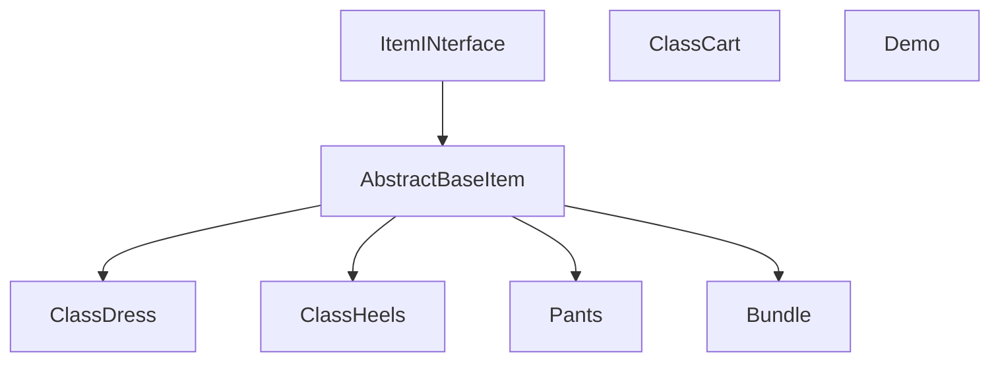

### Decorator
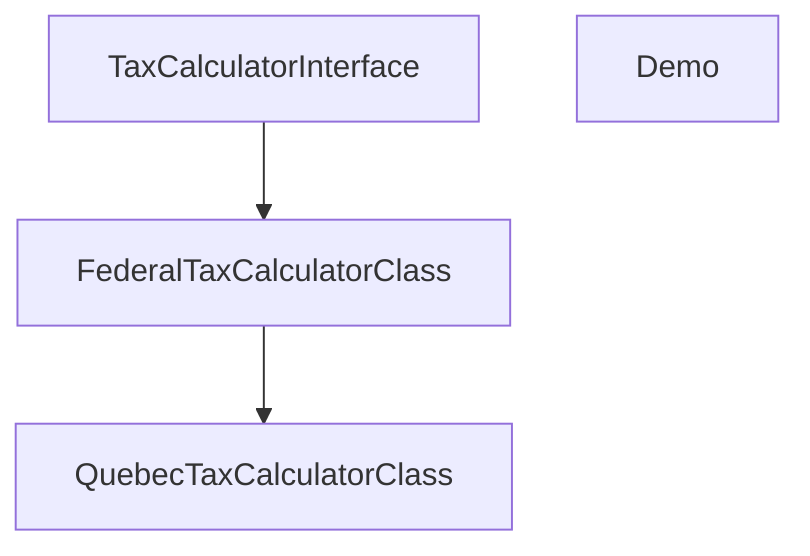

### Facade
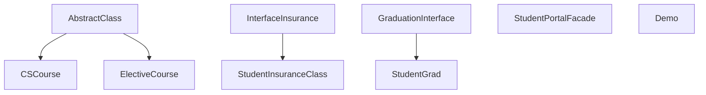

### Lightweight
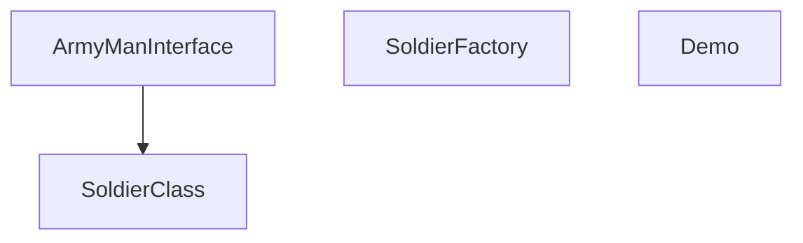

### Proxy
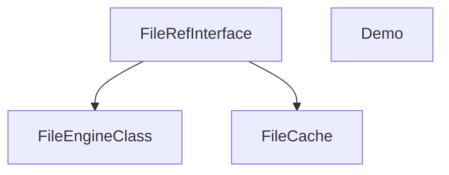

## Behavioral
### Chain of responsibility
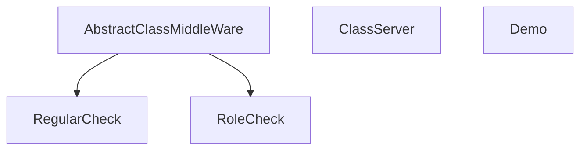
### Command
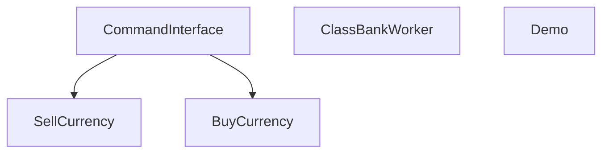

### Iterator
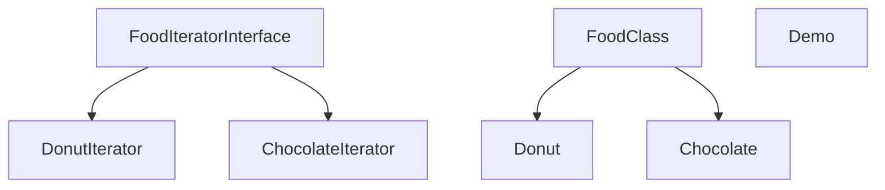

### Mediator
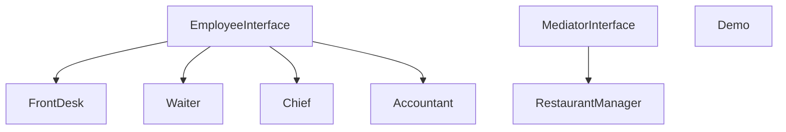

### Memento
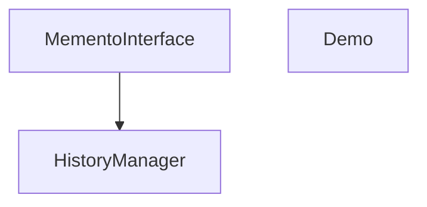

 
